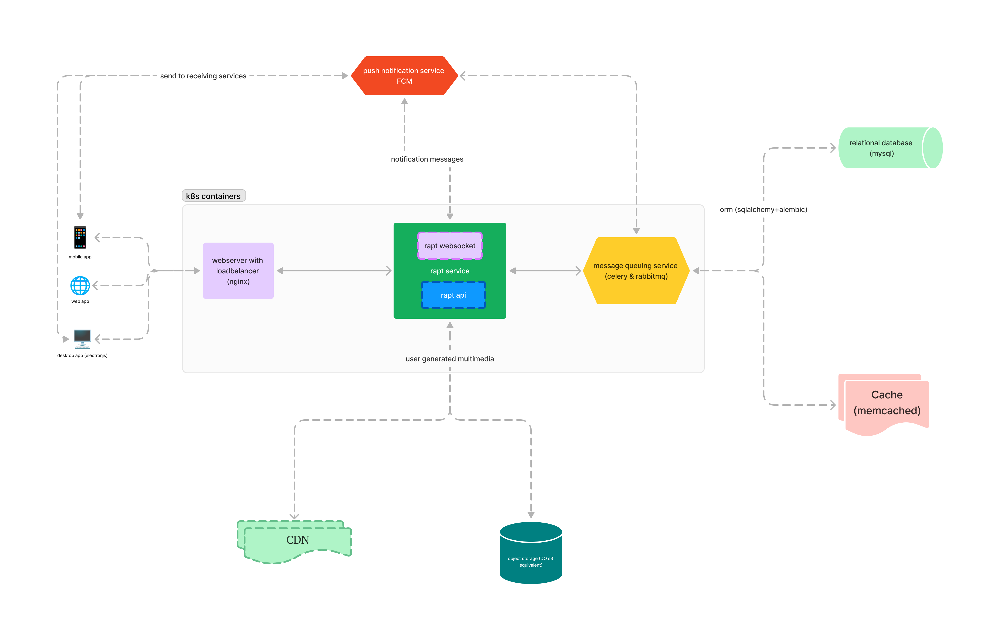
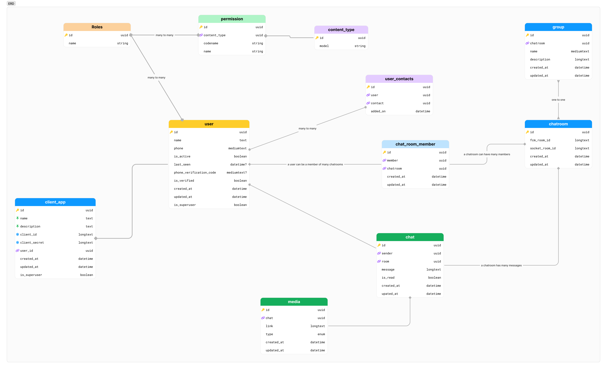

# Rapt.Chat Design

_Chat App. Rapt /răpt/ adjective - Deeply moved or delighted; enraptured._

## Android App

  
  
  

## High level design is shown below
Application is built on python, fastapi, mysql, k8s with the frontend based on nextjs web, electronjs and kotlin for android and swift for iphone app

## Entity relationship diagram (ERD)

## System Flowchart
Shows step by step how the application works

